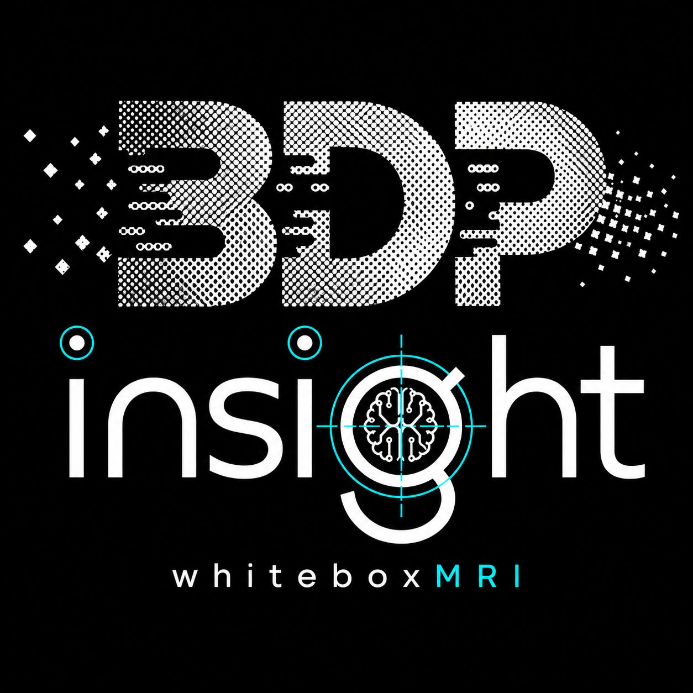

<p align="center">
  
</p>

# BDP-insight L2 HodgeConverter — v0.1.1 Public Prototype — English Edition

**API name:** `BDP-insight-L2` · **whitebox MRI**

A controlled output-prefix intervention prototype for LLM runtime experiments.

---

> ## ⚠ IMPORTANT NOTICE ⚠
>
> **Behavior varies BY MODEL and BY INPUT LANGUAGE.**  
> Even with identical prompt and regex settings, prefix-exposure patterns differ across models and across input languages. **Do not rely on the figures in this document — please reproduce the experiments in your own environment before drawing conclusions.**

---

## API Hub Listing — `BDP-insight-L2`

> BDP-insight provides a prototype HodgeConverter API (`BDP-insight-L2`) for controlled LLM runtime-intervention experiments.  
> The API routes selected token / value / symbol-level intervention requests through an externalized server kernel and returns a compact public result shape.
>
> **It is designed for:**
> - HodgeConverter tutorial reproduction
> - symbolic redirection experiments
> - runtime intervention testing
> - BDP-insight / Meta-13 debugger prototype analysis
>
> This API is **not** intended for bulk text processing. Claims are prototype-level and observational. It does **not** guarantee full control over model reasoning.  
> *Website will be open soon.*

---

## Core public claim

> `BDP-insight-L2` HodgeConverter exposes a controlled output-prefix intervention path. The original prompt text is not rewritten. The debugger observes partial generated output, sends the selected target span to the server-bound Hodge kernel, and resumes continuation from the patched prefix.

**Avoid claim:** `guaranteed reasoning correction`, `universal arithmetic improvement`, `full hidden-state control`, `proof of tensor causality` — none of these.

## Cross-model note (observational)

> The prototype is not Qwen-specific. Qwen is used as the baseline public test model, while Gemma-style structured outputs show that models exposing more intermediate scaffolding can provide a wider intervention surface. This is an observational compatibility note, not a guarantee.

The **Token-Surface Conversion Hypothesis (H1)** is stated as a hypothesis, not a theorem. It concerns the *share* of reasoning that surfaces as tokens — not parameter count.

---

## Quick Start

See `QUICK_START.md` for the 5-minute walkthrough. Detailed §4 in the User Guide PDF.

```
user prompt
-> model begins generation
-> partial assistant output appears
-> target_first_breakpoint checks target_regex
-> server-bound Hodge kernel patches the target span
-> local debugger resumes from the patched prefix
```

## API credentials

Customers only need:

- `X-RapidAPI-Key`
- `X-RapidAPI-Host`

No provider-side secrets are required in client code.

---

## Package layout

```
BDP_L2_HodgeConverter_v0_1_1_English_Edition/
├── README.md                                            # this file
├── QUICK_START.md                                       # 5-minute walkthrough
├── API_HUB_DESCRIPTION.md                               # Short API Hub long description
├── CHANGELOG.md                                         # Version history
├── BDP_L2_HodgeConverter_v0_1_1_User_Guide_EN.pdf       # English User Guide (PDF)
├── BDP_L2_HodgeConverter_v0_1_1_User_Guide_EN.docx      # English User Guide (Word)
├── BDP_L2_HodgeConverter_v0_1_1_Workbook_EN.xlsx        # English Workbook (11 sheets)
├── assets/
│   └── bdp_insight_logo.png                            # BDP-insight whitebox MRI logo
└── kr_appendix/
    └── User_Guide_KR.pdf                               # Korean reference PDF (raw original)
```

## Workbook sheets (11)

| # | Sheet              | Purpose |
|---|--------------------|---------|
| 1  | Overview            | API name, language notice, core claim, counts, sheet guide |
| 2  | Quick_Start         | 5-minute first experiment + common pitfalls |
| 3  | Experiment_Log      | All 29 experiments (Qwen 25 + Gemma 4); raw output preserved verbatim |
| 4  | Success_Examples    | 11 recommended public demonstration cases |
| 5  | Caveats             | 7 caveat classes |
| 6  | Regex_Recipes       | Goal-oriented regex / new_word / wait-cont presets |
| 7  | Behavior_Classes    | 6.1–6.6 within-model + 7.1–7.4 cross-model |
| 8  | Cross_Model_Compat  | Gemma4-4ae records + Token-Surface Conversion Hypothesis |
| 9  | Privacy_Boundary    | Free / Paid / Future tier + customer-vs-provider credentials |
| 10 | Glossary            | 20 key terms |
| 11 | Claude_Handoff      | Hand-off note for follow-up work |

## Privacy notice

- Prompt/token observations or partial generated output may be transmitted to the paid server kernel.
- Do not submit secrets, credentials, personal data, private datasets, or confidential production prompts.
- BDP does not intentionally persist raw prompts or generated text; request payloads are discarded after the operation.
- Operational logs are limited to request IDs, timestamps, status, usage counters, lengths, hashes, and plan metadata.

## Note about preserved Korean text

Several `Experiment_Log` Before/After cells contain Korean text verbatim. The original experiments were run with Korean prompts; reproducing them truthfully is more honest than retroactive translation. Categories, statuses, and analytical commentary are in English.

## License & contact

Prototype-stage research artifact. For questions or feedback please use the BDP-insight project channel.
